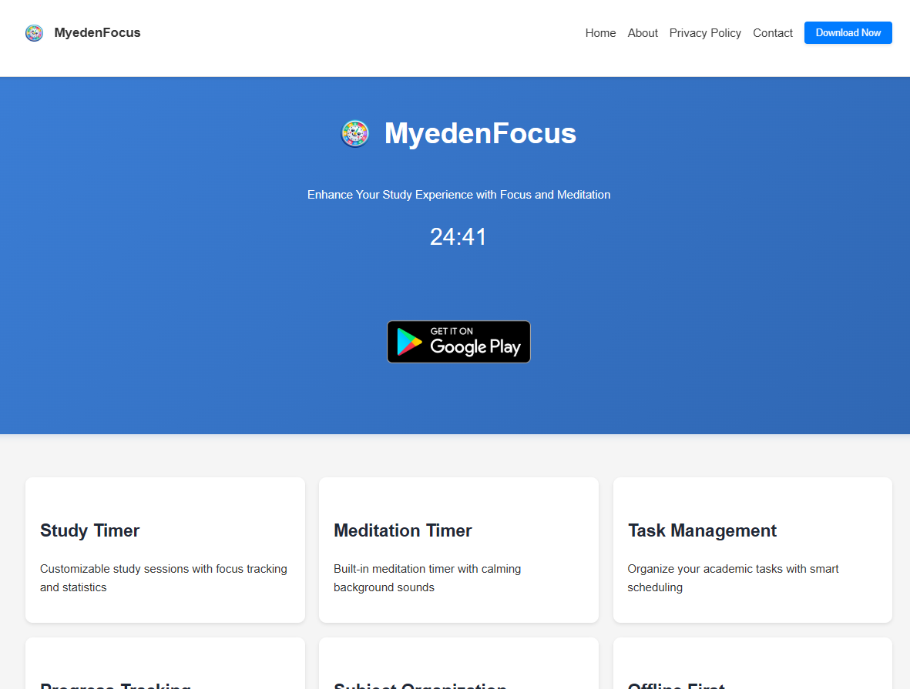

# MyedenFocus Website

A responsive website for the MyedenFocus app. <a href="https://myedenfocus.rf.gd/">Go To Website</a>

## 📁 Project Structure

- `index.php` - Main landing page
- `about.php` - About page
- `contact.php` - Contact information
- `privacy-policy.php` - Privacy policy details
- `header.php` - Common header component
- `footer.php` - Common footer component
- `styles.css` - Main stylesheet
- `styles/modern.css` - Modern UI components
- `.htaccess` - Apache configuration for clean URLs

## 🛠️ Tech Stack

- PHP
- CSS3
- JavaScript
- Google Fonts (Roboto)
- Material Icons

## 🎨 Design

- CSS Variables for consistent theming
- Gradient backgrounds
- Card-based layout
- Hover animations

## 📝 License

© 2025 MyedenFocus. All rights reserved.

## 👥 Contact

For any queries:
- Email: sage_mastermind@hotmail.com
- Developer: Subhajit Gorai 